# Freckle | נמ״ש - System Architecture

**Version**: 1.0
**Date**: 2026-02-09
**Status**: Planning

---

## 1. System Overview

Freckle is a Next.js application that acts as a centralized consumer of multiple product Admin APIs. It does not own any product data. All data is fetched, displayed, and mutated through the standardized REST endpoints that each product exposes.

### High-Level Architecture

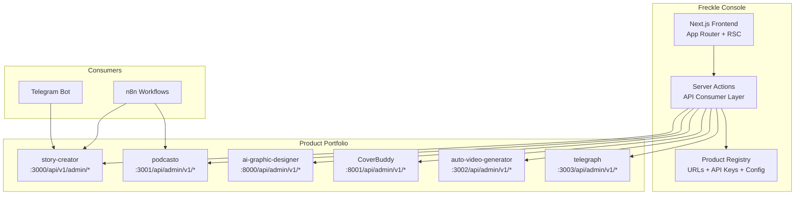

### Key Architectural Decisions

1. **Freckle is a pure consumer**: It has no direct database access to any product. All interactions go through HTTP REST calls to standardized Admin API endpoints.
2. **Products are the source of truth**: Freckle caches nothing beyond short-lived UI state. Every page load fetches fresh data from the product APIs.
3. **The `/meta` endpoint drives the UI**: Freckle reads each product's capabilities from its `/meta` response and conditionally renders UI sections based on what the product supports.
4. **Server-side API calls**: All product API calls happen server-side (Server Components, Server Actions, Route Handlers). API keys never reach the browser.

---

## 2. Data Flow

### Request Lifecycle

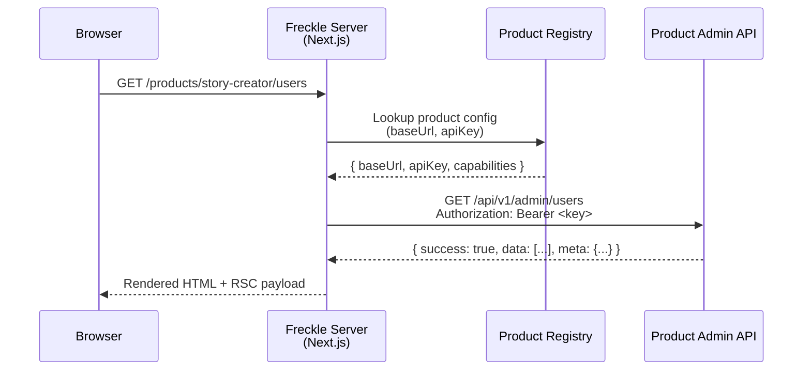

### Write Operations (Mutations)

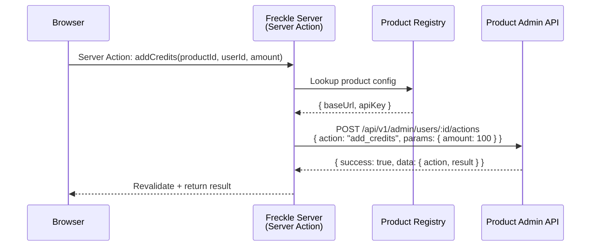

---

## 3. Product Registry

The product registry is Freckle's own data store - the only data Freckle itself persists. It contains the connection details for each registered product.

### Registry Data Model

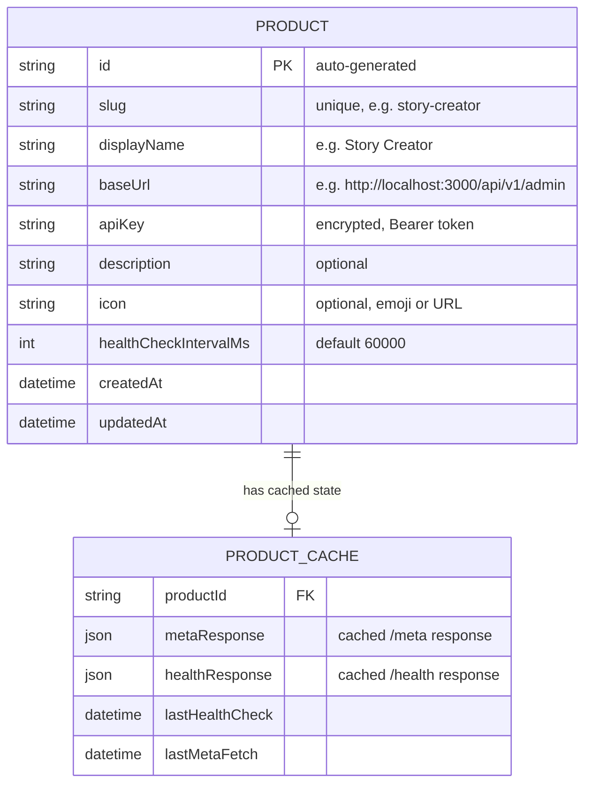

### Product Discovery Flow

When a product is registered in Freckle:

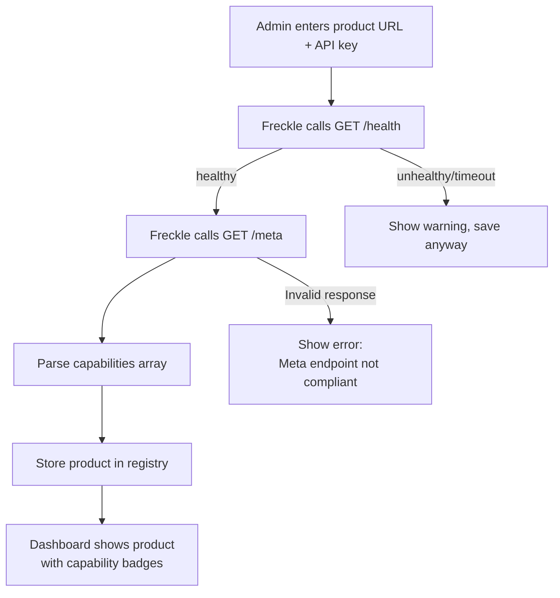

### Capabilities Drive UI

The `/meta` response's `capabilities` array determines which UI sections Freckle renders for each product:

| Capability | UI Section Rendered |
|------------|---------------------|
| `users` | User management table, user detail page, user actions |
| `content` | Content browser, content detail page, content actions |
| `analytics` | Usage charts, activity feed |
| `config` | Configuration editor |
| `credits` | Credits display in user detail, add credits action |
| `operations` | Operations console with available actions |
| `webhooks` | Webhook management (future) |

Products that only implement `health` + `meta` + `stats` still get a dashboard card with health status and key metrics - the minimum viable integration.

---

## 4. Frontend Architecture

### Next.js App Router Structure

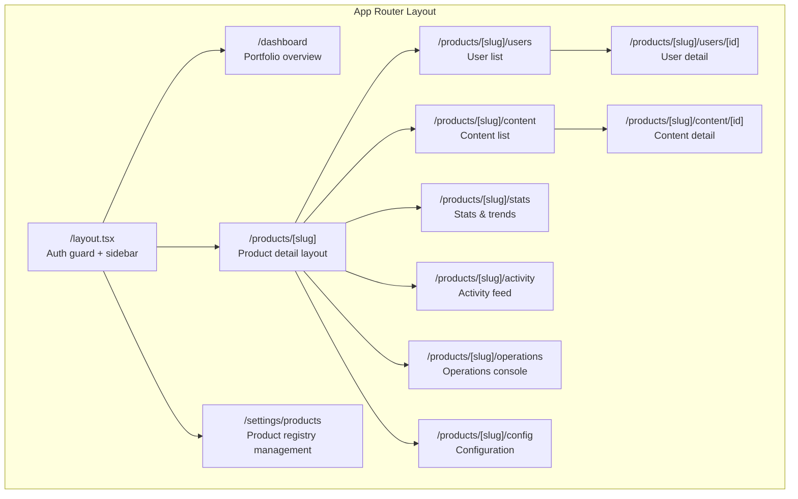

### Server / Client Component Split

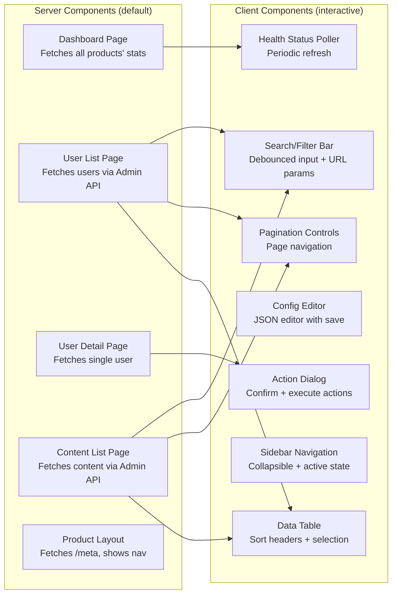

**Principle**: Data fetching happens in Server Components. Interactivity (search, sort, pagination, dialogs, periodic polling) happens in Client Components. API keys never leave the server.

### Generic UI Component Strategy

Because all products follow the same API standard, Freckle uses a set of **generic, data-driven components** that work with any product:

| Component | Driven By | Renders |
|-----------|-----------|---------|
| `<EntityTable>` | Any paginated list response | Sortable table with standard columns (id, name, status, dates) + product-specific `stats` fields |
| `<EntityDetail>` | Any single entity response | Key-value display of all fields, with editable fields inline |
| `<ActionPanel>` | `supportedActions` from `/meta` | Button per action, with confirmation dialog and param inputs |
| `<StatsCard>` | `/stats` response sections | Metric cards with label, value, and optional trend indicator |
| `<TrendChart>` | `/stats/trends` response | Line/bar chart with date axis |
| `<ActivityFeed>` | `/analytics/activity` response | Chronological event list with actor, description, timestamp |
| `<HealthBadge>` | `/health` response | Colored dot (green/yellow/red) with tooltip |

---

## 5. API Consumer Layer

The API consumer layer is a set of server-side utilities that handle all communication with product Admin APIs.

### Component Architecture

```mermaid
graph TD
    subgraph "Server Actions / Route Handlers"
        SA1[getUsersAction]
        SA2[executeActionOnUser]
        SA3[getProductStats]
    end

    subgraph "API Consumer Layer"
        CLIENT[ProductApiClient<br/>Per-product HTTP client]
        REGISTRY[ProductRegistry<br/>Lookup + config]
        TYPES[Standard Types<br/>AdminApiResponse, AdminUser, etc.]
    end

    subgraph "Infrastructure"
        FETCH[fetch() with timeout<br/>+ error handling]
        AUTH[Auth header injection<br/>Bearer token]
        PARSE[Response parser<br/>Validates standard format]
    end

    SA1 --> CLIENT
    SA2 --> CLIENT
    SA3 --> CLIENT
    CLIENT --> REGISTRY
    CLIENT --> FETCH
    FETCH --> AUTH
    FETCH --> PARSE
    PARSE --> TYPES
```

### ProductApiClient

The core abstraction: a typed HTTP client that knows how to talk to any product's Admin API.

```typescript
// Pseudocode - illustrative, not implementation
class ProductApiClient {
  constructor(private baseUrl: string, private apiKey: string) {}

  // Generic typed methods matching the standard
  async getHealth(): Promise<AdminApiResponse<HealthResponse>>
  async getMeta(): Promise<AdminApiResponse<MetaResponse>>
  async getStats(): Promise<AdminApiResponse<StatsResponse>>
  async getTrends(period: string): Promise<AdminApiResponse<TrendsResponse>>

  async getUsers(params: PaginationParams): Promise<AdminApiResponse<AdminUser[]>>
  async getUser(id: string): Promise<AdminApiResponse<AdminUserDetail>>
  async updateUser(id: string, data: Partial<AdminUser>): Promise<AdminApiResponse<AdminUser>>
  async deleteUser(id: string): Promise<AdminApiResponse<DeleteResponse>>
  async executeUserAction(id: string, action: ActionRequest): Promise<AdminApiResponse<ActionResponse>>

  async getContent(params: PaginationParams): Promise<AdminApiResponse<AdminContentItem[]>>
  // ... same pattern for content, analytics, config, operations
}
```

This client is instantiated per-request using the product's registry entry. No singleton, no connection pool - just a stateless HTTP client with the right base URL and API key.

### Error Handling Strategy

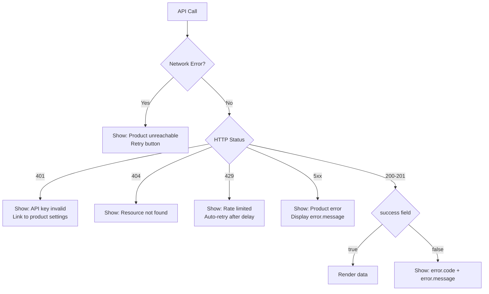

---

## 6. Security Architecture

### Authentication

Freckle has two separate authentication concerns:

#### 1. Admin Auth (Freckle's own login)

Since there is only one admin user, the auth system is deliberately simple:

- **Method**: Password-based login with a server-side environment variable
- **Implementation**: A single `FRECKLE_ADMIN_PASSWORD` env var. Login page validates against it. Session stored in an encrypted HTTP-only cookie.
- **No OAuth, no database users, no registration**: This is a single-user admin tool. Complexity here adds no value.
- **Session expiry**: Configurable (default 7 days). Re-authentication required after expiry.

#### 2. Product API Auth (Freckle calling products)

- **Method**: Bearer token per product, stored encrypted in the product registry
- **Flow**: Freckle's server-side code reads the API key from the registry and injects it into the `Authorization: Bearer <key>` header on every request
- **Key rotation**: Update the API key in Freckle's product settings; takes effect immediately on next API call
- **No keys in browser**: All API calls happen server-side. The browser never sees product API keys.

### API Key Storage

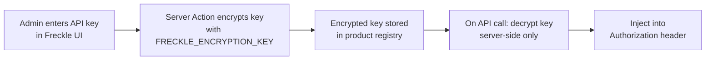

- Encryption at rest using AES-256-GCM
- `FRECKLE_ENCRYPTION_KEY` is a 32-byte env var
- Keys are never logged, never sent to the browser, never included in error messages

### Network Security

Since all products run on the same Oracle Cloud server:

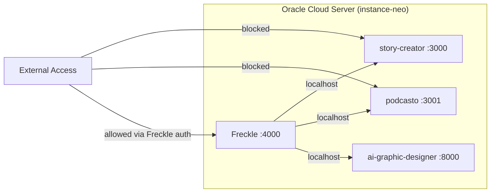

- Product Admin APIs listen on localhost only (or are firewalled)
- Freckle is the only externally-accessible admin interface
- Products validate the API key on every request regardless (defense in depth)
- CORS on products is configured to allow Freckle's origin

---

## 7. Deployment Architecture

### Server Layout

All services run on the same Oracle Cloud instance (`instance-neo`), managed by PM2.

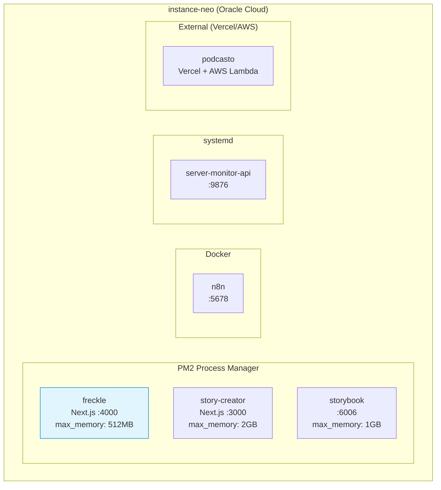

### PM2 Configuration (Addition to ecosystem.config.js)

Freckle will be added as a new PM2 app alongside story-creator and storybook:

| Property | Value | Rationale |
|----------|-------|-----------|
| Port | 4000 | Avoids conflict with story-creator (3000) and storybook (6006) |
| max_memory_restart | 512 MB | Freckle is a lightweight admin console; 512 MB is generous |
| NODE_OPTIONS --max-old-space-size | 384 MB | Leaves headroom within the 512 MB PM2 limit |

### Memory Budget Impact

Current allocation (from CLAUDE.md):
- OS + system services: ~2 GB
- n8n (Docker): ~250 MB
- Claude Code sessions: ~1-2 GB
- story-creator (PM2): 2 GB
- storybook (PM2): 1 GB
- **Available**: ~12 GB for PM2 apps

After adding Freckle (512 MB):
- Total PM2 allocation: 2 GB + 1 GB + 512 MB = **3.5 GB**
- Remaining for future apps: ~8.5 GB
- Well within the 12 GB budget

### Products on External Hosts

Some products (e.g., podcasto on Vercel) are hosted externally. Freckle calls their Admin APIs over HTTPS rather than localhost. The product registry stores the full external URL in this case.

---

## 8. Caching Strategy

Freckle is primarily a real-time consumer, but some strategic caching improves UX:

| Data | Cache Duration | Strategy | Rationale |
|------|---------------|----------|-----------|
| `/health` responses | 60 seconds | In-memory (server) | Avoid hammering health endpoints on every page load |
| `/meta` responses | 5 minutes | In-memory (server) | Meta data changes rarely (only on product deploys) |
| `/stats` responses | No cache | Fresh on every load | Stats should always be current |
| Entity lists (users, content) | No cache | Fresh on every load | Could be stale after mutations |
| Product registry | On-demand | Read from file/DB when needed | Changes only when admin edits settings |

Next.js Server Components with `revalidate` can handle the time-based caching. No external cache layer (Redis) needed for a single-user app.

---

## 9. Future Considerations (Post-v1)

These are explicitly deferred but worth noting for architectural awareness:

- **Webhook receiver**: Freckle could receive push events from products instead of polling, enabling real-time activity feeds and notifications.
- **Cross-product user linking**: Identify the same user across products (by email) and show a unified profile with activity across all products.
- **Scheduled health reports**: Automatic daily/weekly summary of portfolio health sent via Telegram or email.
- **Plugin system**: Allow products to register custom UI widgets that render inside Freckle (beyond the generic components).
- **Audit log**: Persistent log of all admin actions performed through Freckle (currently only in-memory/ephemeral).
